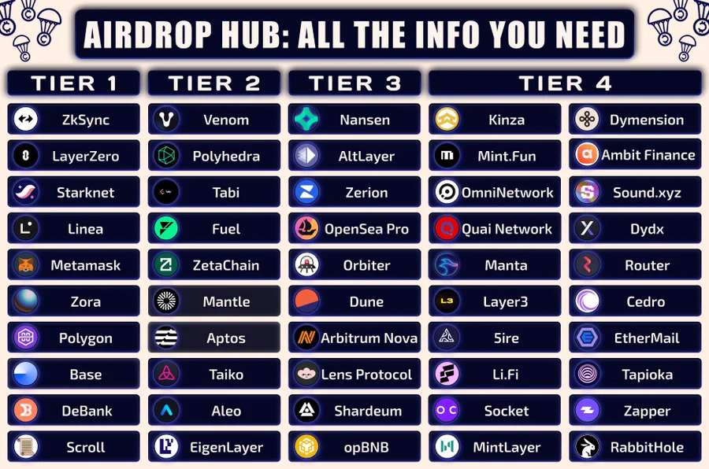
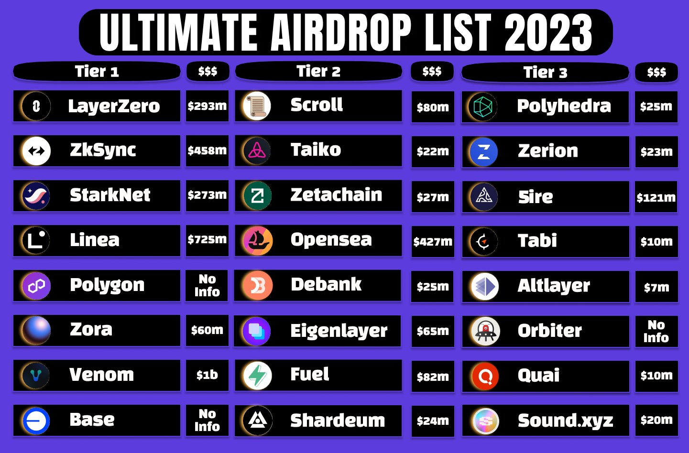
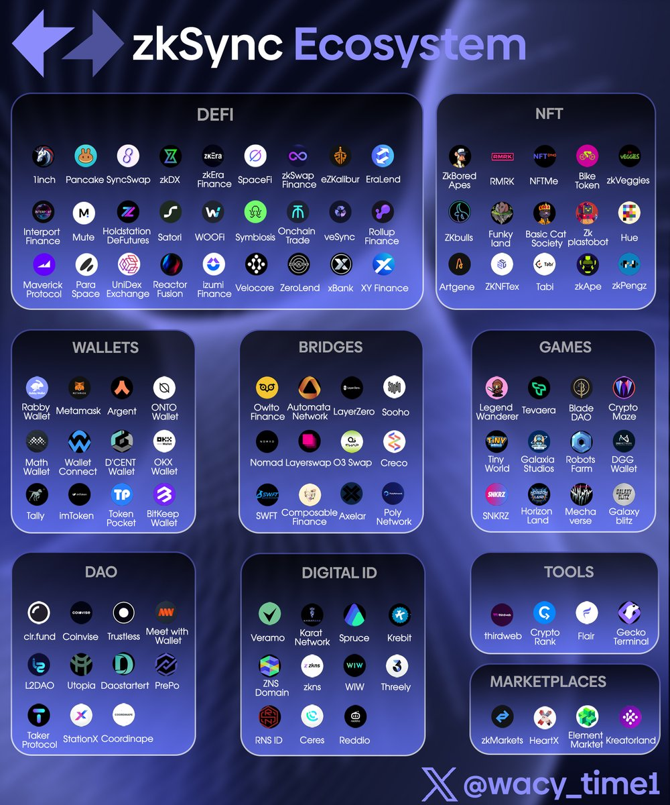

水龙头：
* Goerli: [Alchemy](https://goerlifaucet.com/) (0.02E/day), [QuickNode](https://faucet.quicknode.com/ethereum/goerli) (0.05E * 2/day, 推荐)
* Sepolia: [Alchemy](https://sepoliafaucet.com/) (0.5E/day, 推荐) / [QuickNode](https://faucet.quicknode.com/ethereum/sepolia) (0.05E * 2/day, 推荐) / [PoW挖矿](https://sepolia-faucet.pk910.de)(大约3小时可挖0.05E, 不推荐)

Galxe:
* 【0930结束】[A+ Role](https://galxe.com/galxecommunity/campaign/GCUTpU7t2T)
  * [测试频道](https://discord.com/channels/824767871183355954/1072476542191542332)
  * 40s一道题，需完成8/10，否则需4小时后重试
  * [QAs](Galxe_APlus_Role_QAs.md)
  * [推荐阅读](https://blog.galxe.com/galxe-loyalty-points-system-redefining-web3-loyalty-programs-135a159dcb4c)

打卡：
* [Dmail](https://mail.dmail.ai/compose)
* [SecondLive](https://secondlive.world/bounty/general)

## zkSync 生态

跨链: [官方桥](https://bridge.zksync.io/), [Orbiter](https://www.orbiter.finance/?source=Ethereum&dest=zkSync%20Era), [Layerswap](https://www.layerswap.io/app), [XY Finance](https://app.xy.finance/), [Bungee](https://www.bungee.exchange/refuel), [WOOFI](https://fi.woo.org/swap/)(非美)

Swaps: [SyncSwap](https://syncswap.xyz/), [CAKE](https://pancakeswap.finance/swap?chain=zkSync), [iZiSwap](https://izumi.finance/trade/swap), [SPACE](https://swap-zksync.spacefi.io/#/swap), [MAV](https://app.mav.xyz/), [MUTE](https://app.mute.io/swap), [Velocore](https://zksync.velocore.xyz/swap), [veSync](https://app.vesync.finance/swap), [Wagmi](https://app.wagmi.com/#/swap)

聚合Swaps: [OKX](https://www.okx.com/web3/dex-swap), [1INCH](https://app.1inch.io/#/324/simple/swap/ETH/USDC), [KyberSwap](https://kyberswap.com/swap/zksync/eth-to-usdc), [ODOS](https://app.odos.xyz/), [Symbiosis](https://app.symbiosis.finance/swap?amountIn=1&chainIn=ZkSync%20Era&chainOut=ZkSync%20Era&tokenIn=ETH&tokenOut=0x3355df6D4c9C3035724Fd0e3914dE96A5a83aaf4), [OpenOcean](https://app.openocean.finance/CLASSIC#/ZKSYNC/ETH/USDC)

DeFis: [EraLend](https://app.eralend.com/), OKX([SyncSwap U/E](https://www.okx.com/web3/defi/detail/20711), [SpaceFi U/E](https://www.okx.com/web3/defi/detail/21010)), [SynFutures](https://trade.synfutures.com/#/trade), [Satori](https://zksync.satori.finance/), [zkFox](https://zkfox.io/#/bank), [Reactor Fusion](https://app.reactorfusion.xyz/)

NTF市场: [OKX](https://www.okx.com/web3/marketplace/nft/explore), [Element](https://element.market/account), [Kreatorland](https://kreatorland.com/)

DID: [Safe](https://app.safe.global/), [Tevaera](https://tevaera.com/?source=OKX), [Dmail](https://mail.dmail.ai/presale), [ZNS](https://zks.network/?), [OpenName](https://app.open.name/)

工具: thirdweb （[操作指南](https://twitter.com/ardizor/status/1699134876774195354)）, [NFTs2Me](https://nfts2me.com/chain/zksync-era/)

zkSync Lite: [官方桥](https://lite.zksync.io/account/), [官方NFT](https://lite.zksync.io/account/nft/)（[操作指南](https://mirror.xyz/doger.eth/5rsvFS3GWleRE0Q-1EvbUW5DRQATYBHH4Vz0cNQLefE%E2%80%A6)）, [ZigZag](https://trade.zigzag.exchange/?market=ETH-USDC&network=zksync)(滑点过大，不推荐)

## zkSync 任务
zkSync官方：
* [官方NFT铸造](https://zksync-mint.summon.xyz/)
* [个人版官方NFT铸造](https://explorer.zksync.io/address/0xf630C57ED0E2276313d5b3a35D4cB5Ef3C3f5Ec2#contract) Write - Mint
  * [交互教程](https://twitter.com/gm365/status/1680826465603166208?s=20)
* [Guild Role](https://guild.xyz/zksync-era)

### 跨链类
Orbiter:
* [银河奥德赛](https://galxe.com/OrbiterFinance/campaign/GCUcTUiTut): 2023.09.07结束

zkLink:
* [银河奥德赛](https://galxe.com/zkLink/campaign/GCti5UjiD1): [细节指南](https://twitter.com/duola_eth/status/1698560390987452520)

### DeFi类

SyncSwap:
* 【已结束】[zkSync Grand Carnival Week! Join 30,000 limited SyncSwap CAP Airdrop!](https://taskon.xyz/campaign/detail/5551)

EraLend
* 【已结束】[银河任务（一鱼多吃）](https://galxe.com/eralend/campaign/GCvzAUeVzg)
  * EraLend - SyncSwap 双协议
  * [交互指南](https://twitter.com/yunknkn2/status/1679497749329477633)
    * （前提）进行SyncSwap的ETH-USDC流动性供应
    * 质押SyncSwap的LP份额（交互1），并授权（交互2）供应（交互3）EraLend供应
      * 一定金额以上，达到3/5天有积分
      * 如果不在后续借出ETH或USDC，不用完成交互1
      * 注意：授权（交互2）的是SyncSwap的ETH-USDC池子的比例，非USDC数
    * （后续可选）借出ETH或USDC
      * 一定金额以上，达到3/5天有积分
    * 【注意】因为从SyncSwap LP开始到结束涉及多达7~10步交互，需确保有$3~4的ERA_ETH打底，否则需要利用跨链补充ERA_ETH从而增加成本
  * 【参考】EraLend积分规则：
  

[Satori](https://zksync.satori.finance/)（不支持美国、东亚，[交互教程](https://twitter.com/oldleek_eth/status/1674059322760867846?s=20)）:
* 【已结束】[银河任务](https://twitter.com/Zlican133061/status/1676515660304875520?s=20)
* 【注意】Discord要求手机验证
* OKX Cyperpedia活动持续（要求50U+和至少一笔交易）

[SynFuture](https://trade.synfutures.com/#/trade):
* 【已结束】[银河任务](https://galxe.com/synfutures/campaign/GCRW8UWb3M)
* 美国、英国、东亚禁止

### DID类

KaratDAO:
* 已两轮空投，Gas过高，参与价值待验证
* [Airdrop Claim](https://karatdao.com/network/airdrop)
  * 第二轮：2023.8.24 1:00
* 银河任务
  * [Claimer](https://galxe.com/karat/campaign/GCQDoUe7So)
  * 【已结束】[VCs](https://galxe.com/karat/campaign/GCYLXUWfG8)
    * Twitter、Discord、邮箱和Stream账号，upload（大约消耗1U*4）

Dmail:
* 【已结束】[银河活动](https://galxe.com/dmail/campaign/GCVJ1U7r6A)

NFT:
* Tabi
  * 官网: [Sailor](https://tabi.lol/quest), [Reddit](https://tabi.lol/reddit)
  * [Mermaid](https://tabi.lol/mermaid)（需要注册Reddit），及[银河活动](https://galxe.com/TabiNFT/campaign/GCHKUUWp5m)（申领网为BSC）
    * [关联银河活动](https://galxe.com/TabiNFT/campaign/GCyAfUNdGr)（仍可部分申领）
  * [Partnership - 银河OAT](https://galxe.com/TabiNFT/campaign/GCwETU7iJL)(0723截止)
* [Bounce Finance](https://app.bounce.finance/okxActivity/zksyncera/1): 万一的E做一次交互（需要交互广度时可以玩一玩）
* 【推荐】直接领NFT：
  * [Apple Head](https://galxe.com/applehead/campaign/GCujfUrRvw)(20230921止)
  * [Makx](https://galxe.com/makx/campaign/GC5sMUrwYa)(20230924止)
  * [Tribe on AppleHead](https://galxe.com/applehead/campaign/GC5uuUPjWd)(1005止)
  * [Sleep Finance](https://galxe.com/sleepfinance/campaign/GC571U2HZj)(20231030止)
* 【可选】简单任务NFT：
  * [zkPlanet](https://galxe.com/AcrossProtocol/campaign/GCvmUUbiH9)(20231003止)
* 【推荐】免费OATs:
  * [Crux](https://galxe.com/crus/campaign/GCFeMUHcbM)
  * [Makx](https://galxe.com/makx/campaign/GC7wgUup1z)(截至0925)
* 直接OATs：
  * [AppleHead Linea Cloud](https://galxe.com/applehead/campaign/GCntsUueCk)

链游:
* [Carv](https://carv.io/events/b603f00f-ee4a-5e0c-9dac-2912c4cee384/detail)
  * 【已结束】[徽章认领](https://twitter.com/maik2hello/status/1676540301819920384?s=20)
  * [GEM赢取](https://galxe.com/CARVofficial/campaign/GCQ3RUWXqA) : 2023.08.31

## 其他推荐
Taiko **[银河活动（推荐）](https://galxe.com/taiko/)**: 
> [详细教程](https://mirror.xyz/0x5CCc2a72c1b601cc674FdB6B7Ce551436E6d2AA2/FCy5VTKX6rSVwEAjuZxSEF6HO6No5RcfLlLzgu4T1AE)
>【附】[空投交互指南](https://twitter.com/leshka_eth/status/1689944405573292032)
* [Get Started](https://galxe.com/taiko/campaign/GCeWBUeKCr)
  * Discord需通过Taiko的反机器人测试
  * Gitcoin Passport分值 ≥ 20 可领取2500银河积分
  * Qiz1: C-C-B
  * Qiz2: B-C-C-B-B
* 测试交易准备
  * 领水: Sepolia 0.5E+
  * [添加测试网络和tokens](https://taiko.xyz/docs/guides/setup-your-wallet#steps)
* [Alpha](https://galxe.com/taiko/campaign/GCKxqU5MwL)(截止2023.9.29):
  * Quiz: B-B-A-C-D
  * [Bridge](https://bridge.test.taiko.xyz/): 0.15+ETH Sepolia → Taiko Alpha-3
  * [Swap](https://swap.test.taiko.xyz/#/swap): 0.1ETH+ ETH → BLL/TTKO/HORSE
* [L3 testnet](https://galxe.com/taiko/campaign/GCgaAU7Txt): [交互指南](https://twitter.com/CoinToEarn/status/1689527607308795904), [2](https://twitter.com/VIP8888883/status/1699274751288754241)
  * 访问: [1](https://galxe.com/taiko/campaign/GCkgZU7MsK), [2](https://galxe.com/taiko/campaign/GCcBxU7vDN), [3](https://galxe.com/taiko/campaign/GCJmxU7URF)
  * 提供流动性：
    * [Bridge](https://bridge.test.taiko.xyz/#/): Sepolia → Taiko
    * [提供流动性](https://swap.l3test.taiko.xyz/#/pool): 0.1ETH → BLL/HORSE/TTKO三选一
    * [银河领取](https://galxe.com/taiko/campaign/GCkV5U7pVr): 50 Points & OAT
  * 访问 & 答题：
    * [Quiz1](https://galxe.com/taiko/campaign/GCJ6yU7yjs): D-A-A-B-C
    * [Quiz2](https://galxe.com/taiko/campaign/GChwyU7dSg): D-C-A-B-D
    * [Quiz3](https://galxe.com/taiko/campaign/GCJsQU7e5V): D-B-B-C-C
    * [Quiz4](https://galxe.com/taiko/campaign/GCHphUjES6): C-B-C-D-C
* 【新】[隐藏任务](https://galxe.com/taiko/campaign/GCKxqU5MwL)
  * Qiz: B-B-A-C-D
* 【最新】[Alpha-5任务](https://galxe.com/taiko/campaign/GC5x7Ucecw)（2023.10.24结束）
  * Qiz1: C-B-C-D-C
  * Qiz2: C-B-B-D-C
  * [NFT铸造教程](https://twitter.com/duola_eth/status/1707253984246071778)
* [hello-taiko NFT](https://omnisea.tech/hello-taiko)

## 其他重要生态
### LayerZero

* Swaps:
  * [testnet](https://testnetbridge.com/): Op/Arb E -> Goerli
* NFTs:
  * [OminiX](https://omni-x.io/drops): BASE → Metis, ≈0.45U
  * [Merkly](https://minter.merkly.com/): BASE → KAVA, ≈0.82U
  * [zkBridge](https://zkbridge.com/loyalty)
    * [Pandra](https://zkbridge.com/gallery/pandra):  
      * Polygon → Manta(0.5M), Celo(0.69M, 0.4U), Core(0.69M, 0.5U), Moon(0.73M), Mantle(1.28M, 0.8U)
      * BSC → Celo(0.0024BNB, 0.5U), Core(0.0024BNB, 0.5U)

### StarkNet
[StarkNet生态](https://www.starknet-ecosystem.com/) ([Argent版](https://www.dappland.com/))
* Wallets: [Argent X](https://chrome.google.com/webstore/detail/argent-x/dlcobpjiigpikoobohmabehhmhfoodbb), [Braavos](https://chrome.google.com/webstore/detail/braavos-smart-wallet/jnlgamecbpmbajjfhmmmlhejkemejdma)
* Bridges: [StarkGate](https://starkgate.starknet.io/), [Orbiter](https://www.orbiter.finance/?source=zkSync%20Era&dest=Starknet), Layerswap, [Owlto](https://owlto.finance/bridge)([价目](https://twitter.com/jianshubiji/status/1704753400527872268))
* DEXs: [AVNU](https://app.avnu.fi/en), [JediSwap](https://app.jediswap.xyz/), [mySwap](https://www.myswap.xyz/), [10kSwap](https://10kswap.com/swap), [SithSwap](https://app.sithswap.com/swap/), [StarkEx](https://app.starkex.org/)
* DeFi: [zkLend](https://app.zklend.com/)
* DMail
* Domain: [StartnetID](https://app.starknet.id/)（[1美元5位域名活动](https://app.starknet.id/quantumleap), 20230917结束）

### Linea
Linea生态
* DEXs：SyncSwap、[HorizonDEX](https://app.horizondex.io/swap)、[EchoDEX](https://www.echodex.io/swap)、[OpenOcean](https://app.openocean.finance)、[KyberSwap](https://kyberswap.com/swap/linea/eth-to-busd)、[Symbiosis](https://app.symbiosis.finance)、[MesProtocol](https://app.mesprotocol.com/spot/ETH-USDC)、[iZUMi](https://izumi.finance/trade/swap)、[VeloCore](https://linea.velocore.xyz/swap)
* DeFi：[LineaBank](https://lineabank.finance/bank)
* NFTs：[BiLinear](https://www.bilinear.io)、[Zonic](https://zonic.app/collection/linea-voyage)
* GameFi：[Battlemon](https://battlemon.com)、[Tatarot](https://tatarot.ai)、[Zypher](https://app.zypher.game)

[Layer3任务](https://layer3.xyz/quests/explore-linea-with-layer3)

### Base
[Base生态](https://www.baseuniverse.space/)
BASE链任务：
* [Mission Web3银河活动](https://galxe.com/MissionWeb3): [问题答案](https://twitter.com/maik2hello/status/1693429404222054804)
* [BASE主网之夏银河活动](https://galxe.com/base/campaign/GC25AU7PaZ)
  * [直接购买NFT](https://nft.coinbase.com/collection/base/0xEa2a41c02fA86A4901826615F9796e603C6a4491)
  * 【已结束】完成第一个主网之夏第一个NFT后：[Layer3活动](https://layer3.xyz/quests/claim-your-onchain-summer-nft)
* [MSB空投](https://mintbase.net/airdrop)

### Scroll

Sepolia测试网：
* 领水
* [钱包添加网络](https://scroll.io/portal)
* [Sepolia桥接](https://scroll.io/bridge): 0.2+ Sepolia ETH
* Swaps & LPs:
  * [Symbiosis](https://testnet.symbiosis.finance/swap?chainIn=Scroll%20Testnet&tokenIn=ETH): 跨链（Scroll Sepolia → ScrollAlhpa）, ETH <-> WETH
  * [SyncSwap](https://syncswap.xyz/): ETH <-> USDC / WETH, LP
    > 注意切换至`Scroll Alpha`网络
  * [Uniswap](https://uniswap-v3.scroll.io/#/swap): ETH <-> USDC / WETH, LP
* Deploys & NFTs:
  * [Omnisea](https://omnisea.tech/spaces/SCROLL_ECOSYSTEM): Mint 1+
  * [NFTs2Me](https://nfts2me.com/)
  * [仓鼠任务](https://activity.hamsternet.io/)
  * [thirdweb](https://thirdweb.com/thirdweb.eth/TokenERC20)
* [Layer3任务](https://layer3.xyz/quests/scroll-q1), [2](https://layer3.xyz/quests/scroll-q2)(需要钱包里有0.005E，反女巫检查)
* [银河活动官方指南](https://twitter.com/Galxe/status/1701627908304130216)

### EigenLayer生态
[EigenLayer](https://app.eigenlayer.xyz/)生态任务:
  * **EigenWorlds NFT**: [官方](https://mint.eigenlayer.xyz/)(Gas Limit 130K, 实际87K。截止2003.08.31 00), 
    * Basic Layer: [mint.fun](https://mint.fun/ethereum/0x8d0802559775C70fb505f22988a4FD4A4f6D3B62)(Gas Limit 87K)
    * Restaker: 参与过质押（[交互指南1](https://twitter.com/jianshubiji/status/1693908864322949300), [2](https://twitter.com/maik2hello/status/1693920645003006129)）
* 【已结束】[AltLayer银河活动](https://galxe.com/undefined/campaign/GC9tiUeiq3)：400分
  * 2023.08.16截止
  * Discord需手机验证
  * 教程：[准备工作](https://docs.altlayer.io/altlayer-documentation/rollup-launchpad/altitude-phase-iii-restaking-tier/prerequisite-restake-with-eigenlayer)，[交互工作](https://docs.altlayer.io/altlayer-documentation/rollup-launchpad/altitude-phase-iii-restaking-tier/launching-restaking-trial-flash-layer)
    * Step0: Get Goerli testnet tokens using [faucet](https://goerlifaucet.com/)
      * 0.02E 测试网代币足够
    * Step1: Lido staked Ether:
      * 合约地址：`0x1643E812aE58766192Cf7D2Cf9567dF2C37e9B7F`
      * 确保转移略大于0.0106stETH
    * Step2: Restaking using [Eigenlayer](https://goerli.eigenlayer.xyz/)
    * Step3: Create a Flash Layer using [AltLayer Rollup Launchpad](https://altitude.altlayer.io/)
      * 需要注意使用独特的Flash Layer Name，并耐心尝试（高峰期不容易成功）
    * Step4: Wait for deployment completion
      * 需要等待自己部署的Flash Layer状态变为Active（紫蓝色，而非红色的Deploying或绿色的Queued）才算成功
  * [活动介绍博客](https://blog.altlayer.io/altlayer-collaborates-with-eigenlayer-on-altitude-phase-iii-restaking-to-launch-flash-layer-73626afce02fv)
